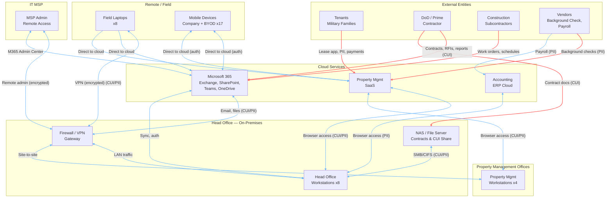

# Data Flow Diagram & Analysis

## Confidential — NIST SP 800-171 Readiness Assessment

---

### 1. Purpose

This document maps how data — particularly PII and potential CUI — flows through the organization's environment. It identifies data origins, transit paths, storage locations, trust boundaries, and potential risk points.

The data flow analysis directly informs control testing across Access Control (AC), System and Communications Protection (SC), Media Protection (MP), and Incident Response (IR) families.

---

### 2. Logical Data Flow Diagram



**Legend:**

| Line Color | Meaning |
|:----------:|---------|
| Red | External data entering the boundary (highest risk) |
| Blue | Internal / authorized data flow within boundary |

---

### 3. Key Data Flow Paths (Narrative)

#### Path 1: Tenant Onboarding (PII + Potential CUI)

```
Tenant → PM SaaS (application, PII) → PM Office Staff (review, approval) 
       → Background Check Vendor (SSN, credit check) → PM SaaS (results) 
       → Lease Agreement (signed) → PM SaaS + NAS (backup copy)
       → Military Housing Occupancy Data (potential CUI)
```

**Data Types:** Name, SSN, DOB, employment history, credit history, lease terms, unit assignment, military affiliation

**Trust Boundaries Crossed:**
- Tenant (untrusted external) → PM SaaS (cloud) — encrypted HTTPS
- PM SaaS → Background Check Vendor (third-party) — API, encrypted
- PM SaaS → NAS (on-prem backup) — decrypted at PM workstation, re-encrypted in transit to NAS?

**Risk Observations:**
- Two external third parties handle tenant PII (PM SaaS vendor, background check vendor)
- Backup of PM SaaS data to NAS may involve downloading and re-uploading — possible plaintext exposure window
- Military affiliation data could be CUI — classification not confirmed

---

#### Path 2: DoD Contract Management (CUI)

```
DoD/Prime → Email (M365) → Admin/Exec → NAS (Contract Documents share)
         → SharePoint (collaboration) → Construction Team
         → Project Management Tool (milestones, deliverables)
         → Reporting back to Prime via email (M365)
```

**Data Types:** Contract terms, pricing, specifications, military housing infrastructure details, deliverables, reporting

**Trust Boundaries Crossed:**
- DoD (external) → M365 (cloud) — encrypted in transit
- M365 → NAS (on-prem) — via download/upload
- M365 → External collaboration partners (guest access in Azure AD)

**Risk Observations:**
- Contract documents (potential CUI) reside in both M365 cloud and on-prem NAS — dual storage locations must both be compliant
- External guest users in Azure AD with access to CUI-bearing SharePoint sites require review
- No data classification labeling visible — employees may not know what is CUI

---

#### Path 3: Remote / Field Access (CUI + PII)

```
User (field) → Laptop → VPN Tunnel (encrypted) → Firewall → NAS / Internal Systems
User (field) → Laptop → Direct Internet → M365 / PM SaaS (authenticated)
User (field) → Mobile → Direct Internet → M365 / PM SaaS (authenticated)
```

**Data Types:** All data types — CUI, PII, operational

**Trust Boundaries Crossed:**
- Uncontrolled network (coffee shop, construction site, home) → VPN → internal network
- Uncontrolled network → Cloud (direct)

**Risk Observations:**
- VPN provides encryption to on-prem, but direct-to-cloud traffic relies on HTTPS only — no additional network layer protection
- Mobile devices access CUI/PII without VPN; rely entirely on app-level security and Conditional Access
- BYOD devices have no endpoint management — if compromised, cloud data is exposed
- No session timeout observed on mobile access — unlocked phone = open access to CUI

---

#### Path 4: MSP Remote Administration (Privileged Access)

```
MSP Technician → Remote Admin Tool → Firewall (admin port) → NAS / Server
MSP Technician → M365 Admin Center → All M365 data
```

**Data Types:** All — full administrative access

**Trust Boundaries Crossed:**
- MSP (external) → Firewall (admin VPN) → Internal network
- MSP (external) → M365 (cloud) — via admin portal

**Risk Observations:**
- MSP has effective unlimited access to the CUI environment
- No documented restriction on MSP data access (what they can see, copy, modify)
- No monitoring or logging review of MSP activities identified
- MSP accounts likely not covered by organizational MFA policy (verify)

---

#### Path 5: Inter-Office Communication (PII + Potential CUI)

```
Property Office A ↔ M365 (email, Teams) ↔ Head Office
Property Office B ↔ M365 (email, Teams) ↔ Head Office
Property Office A ↔ PM SaaS ↔ Property Office B
```

**Data Types:** Operational data, tenant PII, lease records, maintenance requests

**Trust Boundaries Crossed:**
- Property offices → Internet → Cloud — encrypted (HTTPS)
- Property offices → Head Office — via internet-based cloud, not direct WAN

**Risk Observations:**
- No site-to-site VPN between property offices and head office — all traffic routes through cloud
- Property office workstations have no local CUI storage (browser-based) — good, but printing creates local exposure
- Printers at property offices may retain CUI/PII in memory — verify

---

### 4. Trust Boundary Analysis

```mermaid
flowchart LR
    subgraph TB0["Trust Boundary 0 — Fully Controlled"]
        direction TB
        NAS
        WKS_HQ
        FW_Internal[Firewall (Internal Interface)]
        SW[Managed Switch]
    end

    subgraph TB1["Trust Boundary 1 — Cloud Tenants (Shared Control)"]
        direction TB
        M365
        PMS
        ERP
    end

    subgraph TB2["Trust Boundary 2 — Remote / Field (Limited Control)"]
        direction TB
        LAP
        MOB_CO[Company Mobile]
        MOB_BYOD[BYOD Mobile]
    end

    subgraph TB3["Trust Boundary 3 — External (No Control)"]
        direction TB
        T[Tenants]
        G[DoD]
        S[Subcontractors]
        V[Vendors]
        MSP[IT MSP]
    end

    TB2 <-- "VPN + HTTPS" --> TB0
    TB2 <-- "HTTPS Only" --> TB1
    TB3 <-- "HTTPS / Email" --> TB1
    TB3 <-- "Encrypted Email" --> TB0
```

| Trust Boundary | Level of Control | Key Risk |
|:--------------:|:----------------:|----------|
| **TB0** — On-Prem Internal | Full control | Physical security, insider threat |
| **TB1** — Cloud Services | Shared (limited) | Vendor security posture, misconfiguration |
| **TB2** — Remote / Field | Partial | Endpoint compromise, unsecured networks |
| **TB3** — External | None | Phishing, data leakage, third-party breach |

---

### 5. Data Flow Risk Observations

| # | Observation | Risk | Affected Data | Related Control Families |
|:-:|-------------|:----:|:-------------:|:------------------------:|
| 1 | **No data classification labeling** — Employees cannot distinguish CUI from non-CUI in email or documents | High | CUI | AC, AT, SC |
| 2 | **Direct-to-cloud access from unmanaged BYOD** — Mobile devices access CUI/PII without device compliance checks | **Critical** | PII, CUI | AC, SC, IA |
| 3 | **PM SaaS backup to NAS creates data spill risk** — Downloading cloud data to on-prem file share may leave unencrypted copies in transit or at rest | Medium | PII, CUI | MP, SC, CA |
| 4 | **MSP privileged access unmonitored** — No logging or alerting on MSP administrative actions | High | All data | AC, AU, IR |
| 5 | **External guest users in M365 with potential CUI access** — Guest accounts may not be reviewed or removed | High | CUI, PII | AC, IA |
| 6 | **No site-to-site VPN between property offices and head office** — All traffic routed through internet to cloud | Low | Operational | SC (compensating controls via HTTPS) |
| 7 | **Potential for shadow data paths** — Employees using personal email, USB drives, or unauthorized cloud storage to share files | Medium | CUI, PII | AC, AT, MP |
| 8 | **Printers at property offices retain data in memory** — CUI/PII may be stored on printer hard drives without encryption | Low | PII | MP |

---

### 6. Data Flow Verification Plan

During the technical verification phase, the following will be tested:

| Verification | Method |
|-------------|--------|
| Confirm all CUI/PII traffic is encrypted in transit | Network capture / configuration review |
| Verify VPN encryption strength (protocol, cipher) | Configuration review |
| Review M365 data sharing settings (external sharing, guest access) | M365 Admin Center review |
| Verify PM SaaS vendor encryption practices (in transit, at rest) | Vendor documentation / SOC 2 review |
| Test for unapproved data paths (USB, personal cloud, personal email) | Policy review + interviews |
| Confirm MSP access is logged and reviewed | Log review / interview |

---

*Document Version: 1.0*
*Date: July 13, 2026*
